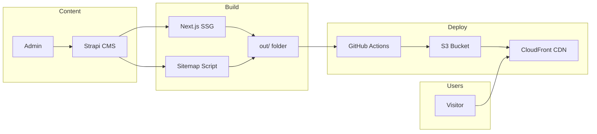

# Project Handover — Ohwise Web Hub

This document gets you oriented so you can take over the **ohwise-web-hub** and **ohwise-cms** projects and deliver a production-ready, SEO-optimized website that serves as the public face of the Ohwise multi-agent app. **Your work lives in two GitHub repos:** the CMS backend (**ohwise-cms**) and the marketing site frontend (**ohwise-web-hub**). You also have read-only access to two reference repos (heunify-frontend, heunify-backend).

---

## What You're Building

- **ohwise-web-hub**: The public marketing/blog site for Ohwise. Right now it's a simple static site; your job is to turn it into a **production-ready static site** with:
  - **Blog**: Single level only — `/blog` (list) and `/blog/[slug]` (post). No extra hierarchy (no thoughts, product, or content-by-type).
  - **Static pages**: Home, About, Contact, Privacy, Terms. Keep these. Pricing can be added later.
  - **Social links**: Show site social links (e.g. Twitter, GitHub, LinkedIn, YouTube from site-setting or about) in the footer (or header) so visitors can follow Ohwise.
  - **Video tutorials (optional)**: Video tutorials can be uploaded in the CMS and displayed in a section on the **landing page**; see doc 02 (§2.9) and doc 03 (Landing page: Video tutorials section).
  - **Later (optional)**: Documentation, pricing — same pattern if needed.
- **Backend**: A **lightweight CMS** at **strapi.ohwise.com**, hosted in the **ohwise-cms** repo. You can build it by copying **heunify-backend** (Strapi v5, open-source) into ohwise-cms, or use another CMS you're familiar with — as long as it exposes the API described in doc 02. The frontend only talks to it at build time (and for contact form, newsletter, comments, OAuth).

**Reference (read-only):** **heunify-frontend** has features to copy (e.g. generating static HTML pages and sitemaps). **heunify-backend** uses **Strapi v5**; you can copy it to ohwise-cms or adapt. **Frontend work is done directly in ohwise-web-hub.** The project owner will add GitHub Actions to deploy the frontend and CMS; you don't need to set up CI/CD.

---

## How It Works (High Level)



- **At build time**: Next.js runs `next build` (static export). A script runs after the build and calls Strapi to get all blog (and other) URLs, then writes `sitemap.xml` and optionally search data into `out/`. So the **entire site** (landing, blog list, blog posts, about, contact, etc.) is static HTML in `out/`.
- **Deploy**: GitHub Actions syncs `out/` to an S3 bucket and invalidates CloudFront. Users get pages from the CDN; no server round-trip for normal page views.
- **Client-side only**: Contact form, newsletter signup, Google/GitHub OAuth, and comments — these call the Strapi (or your backend) API from the browser. Search is static (e.g. a JSON of post titles/descriptions generated at build and used in the client).

---

## GitHub repos (you have access to all 4)

| Repo | URL | Your role |
|------|-----|-----------|
| **ohwise-cms** (backend) | https://github.com/jw-open/ohwise-cms | **Work here.** Build the CMS (Strapi or other). Copy from heunify-backend (Strapi v5) or use a CMS you know; match the API in doc 02. |
| **ohwise-web-hub** (frontend) | https://github.com/jw-open/ohwise-web-hub | **Work here.** Build the marketing site: blog, static pages, static HTML + sitemap. Copy patterns from heunify-frontend. |
| **heunify-frontend** (reference) | https://github.com/jw-open/heunify-frontend | Read-only. Copy features such as static HTML generation and sitemaps. Do not modify. |
| **heunify-backend** (reference) | https://github.com/jw-open/heunify-backend | Read-only. Uses **Strapi v5** (open-source CMS). Copy to ohwise-cms or use another CMS; ensure the API contract in doc 02 is satisfied. |

**Summary:** Your deliverables are in **ohwise-cms** and **ohwise-web-hub**. The project owner will add GitHub Actions to deploy them; you focus on the backend and frontend implementation.

---

## Local Setup (Get Running Quickly)

### Prerequisites

- **Node.js** 18+ (e.g. 20 or 21).
- **npm** (or use the same version as in the project).
- (Optional) **Docker** if you run Strapi in a container.

### 1. Run the backend (ohwise-cms)

- **Repo:** https://github.com/jw-open/ohwise-cms  
- **Database:** Production uses **MySQL on AWS EC2** (not RDS). The database is already provisioned. For your work, use **local MySQL** for development and testing — no need to configure or touch the production DB.
- You can copy **heunify-backend** (Strapi v5) into ohwise-cms or use another CMS you're familiar with. Use **02-BACKEND-BUILD-GUIDE.md** for the API contract. Run the CMS locally (e.g. `npm run develop`, often `http://localhost:1337`; for local DB set `DATABASE_HOST=localhost`).

You need the backend running so the frontend can fetch content at build time (and so contact/newsletter/comments work in dev).

### 2. Run the frontend (ohwise-web-hub)

**Repo:** https://github.com/jw-open/ohwise-web-hub — work directly in this repo. Use **heunify-frontend** (https://github.com/jw-open/heunify-frontend) only as reference for static HTML and sitemap patterns.

```bash
# In ohwise-web-hub
npm ci
```

Create a `.env.local` (or set env vars) so the app can reach Strapi. Use **strapi.ohwise.com** for production; locally use your Strapi URL:

```bash
# Production: https://strapi.ohwise.com
NEXT_PUBLIC_STRAPI_API_URL=http://localhost:1337
# Optional: for build-time access to draft content
# NEXT_PUBLIC_STRAPI_TOKEN=your-api-token
```

Then:

```bash
# Development (hot reload)
npm run dev
# Open http://localhost:3000

# Production-style static build (what CI does)
npm run build
# Then serve the static export
npx serve out
# Open http://localhost:3000 (or the port serve prints)
```

**Build note:** The `build` script runs `next build` and then the sitemap script. The sitemap script **calls Strapi** to get content URLs. So Strapi must be reachable at `NEXT_PUBLIC_STRAPI_API_URL` when you run `npm run build`, and the Strapi API must already expose the endpoints described in doc 02.

### 3. Quick sanity check

- Open the landing page.
- Open `/blog` (list) and one blog post.
- Submit the contact form and (if implemented) newsletter — both should hit your Strapi.

---

## Where to Find What (heunify-frontend)

Use this as a map when you **copy** logic from heunify-frontend **into** ohwise-web-hub. Do not modify heunify-frontend.

| What you need           | Where it is in heunify-frontend |
|-------------------------|----------------------------------|
| App layout, global UI   | `src/app/layout.tsx` |
| Static pages            | `src/app/*/page.tsx` (e.g. `about`, `contact`, `page.tsx` for home) |
| Blog list (adapt to /blog) | `src/app/content/[type]/page.tsx` — copy and simplify to `/blog` only |
| Blog detail (adapt to /blog/[slug]) | `src/app/content/[type]/[slug]/page.tsx` — copy and simplify to `/blog/[slug]` |
| Build-time data (home, nav, settings) | `src/lib/get-static-data.ts` |
| All Strapi API calls    | `src/services/strapi.tsx` |
| Types (content, settings, nav, etc.) | `src/types/index.tsx` |
| Sitemap + search data generation | `src/scripts/generate-sitemap.ts` |
| Static export + config  | `next.config.js` (`output: 'export'`) |
| Deploy workflow         | `.github/workflows/deploy.yml` |
| Public assets           | `public/` (e.g. `robots.txt`) |

The frontend expects a specific Strapi API shape. **02-BACKEND-BUILD-GUIDE.md** lists every endpoint and field so you can implement the backend without needing the heunify-backend source.

---

## Tips: AI tools and code quality

- **You can use Cursor, Claude Code, or any AI coding assistant** to speed up implementation. That’s encouraged.
- **Keep the codebase maintainable and reusable.** Follow basic software engineering principles: clear naming, small focused functions, avoid duplication (DRY), and a consistent structure. Someone else (or you later) should be able to change or extend the code without confusion.
- **Avoid shortcuts that hurt long-term maintenance.** Don’t paste large blocks without understanding them; don’t leave dead code or unused dependencies; don’t hardcode config that should be env-based. Prefer simple, readable code over clever one-offs.
- **Think about performance in normal use.** For this project that means: efficient Strapi queries (pagination, minimal populate), and on the frontend, not blocking the main thread or loading huge bundles for small features. No need to over-optimize; just don’t introduce obvious bottlenecks.

The goal is a backbone that stays easy to maintain and extend — not one that becomes hard to change after the first version.

---

## What to Do Next

1. **Read 02-BACKEND-BUILD-GUIDE.md** — Build the CMS in **ohwise-cms** (copy heunify-backend/Strapi v5 or use another CMS). Use local MySQL for dev; production DB (MySQL on EC2) is already set up.
2. **Read 03-FRONTEND-IMPLEMENTATION-GUIDE.md** — Implement the site in **ohwise-web-hub**: blog first, then static pages. Ensure the project builds and produces `out/`. **The project owner will add GitHub Actions to deploy both repos** once the backbone is done.

Start with **01** (this doc) for context, then **02** for the backend, then **03** for the frontend.
